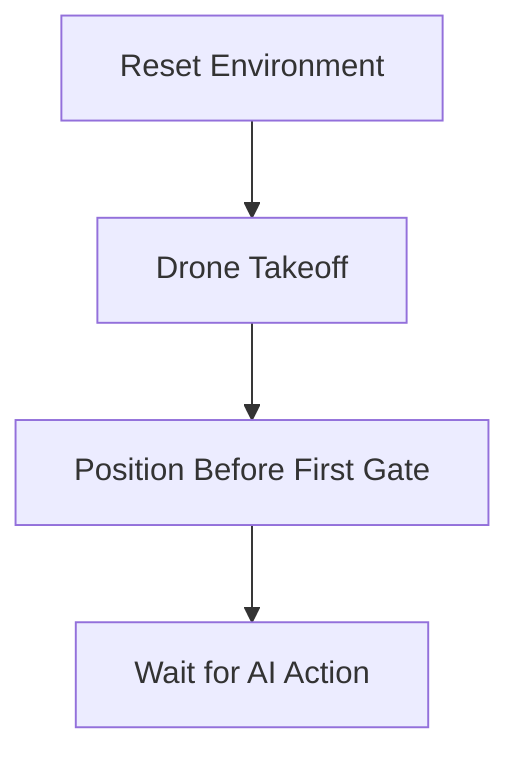
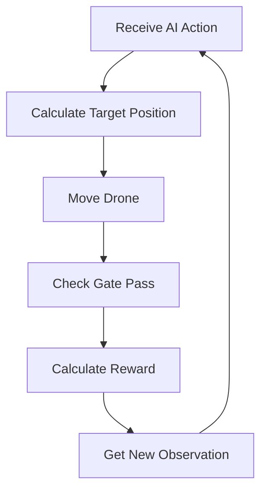
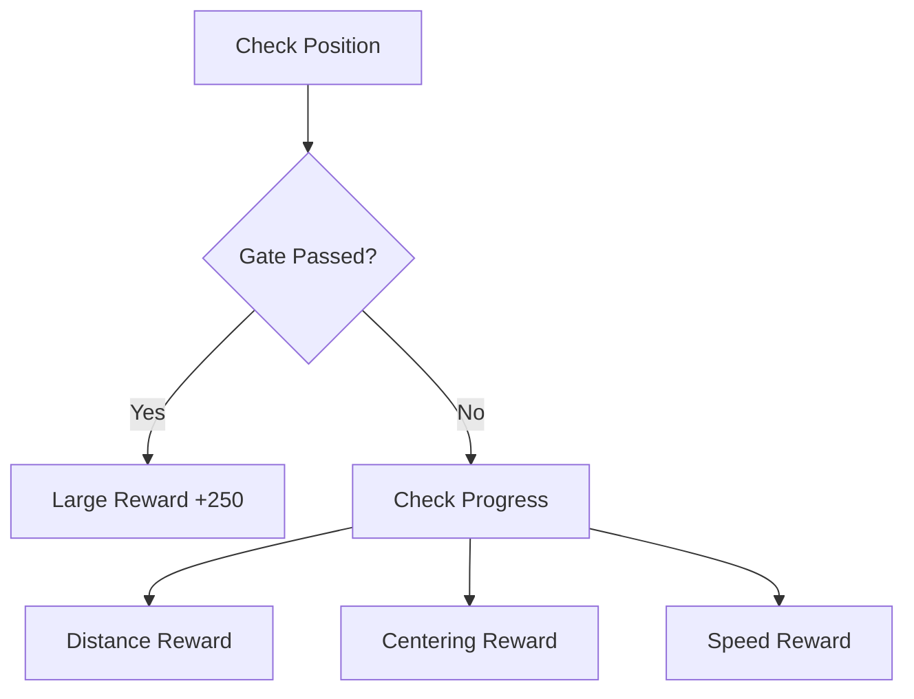
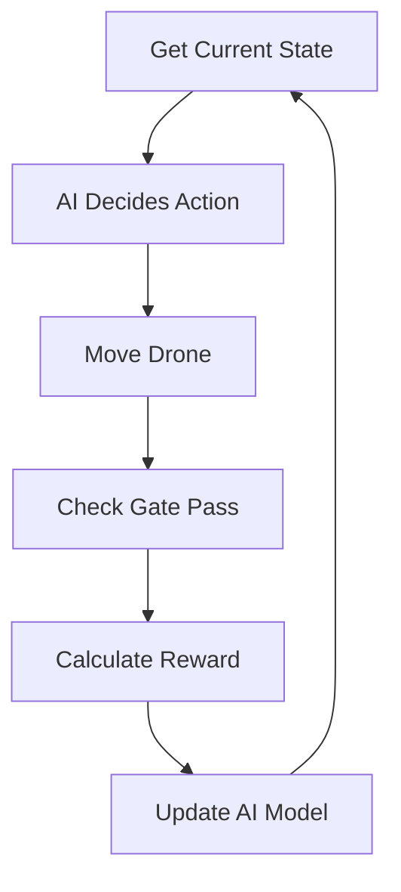

# Discussion Log: Understanding AirSim Drone Racing Project

## Question 1: Understanding Code Logic and Reward System
**User:** can you explain the logic behind this code? How the rewards system work and how drone learn to fly

**Assistant:** I'll help you understand the logic behind this code. Let me first examine the relevant files to provide a comprehensive explanation.

The code implements a reinforcement learning environment that teaches a drone to fly through gates. Here's how it works:

1. **Class Initialization**
```python
class GateRacingEnv(gym.Env):
    def __init__(self, gate_positions, gate_radius=3.0):
        # Initialize AirSim connection
        self.client = airsim.MultirotorClient()
        self.client.confirmConnection()
        self.client.enableApiControl(True)
        self.client.armDisarm(True)
        
        # Gate setup
        self.gate_positions = np.array(gate_positions)
        self.num_gates = len(gate_positions)
        self.gate_radius = gate_radius
```
This sets up:
- Connection to AirSim simulator
- Gate positions and configuration
- Episode tracking variables

2. **Action and Observation Spaces**
```python
# Action space: [forward_offset, lateral_offset, vertical_offset, yaw_angle]
self.action_space = spaces.Box(
    low=np.array([-5.0, -5.0, -2.0, -np.pi]),
    high=np.array([15.0, 5.0, 2.0, np.pi]),
    dtype=np.float32
)

# Observation space (25 values)
self.observation_space = spaces.Box(
    low=-np.inf,
    high=np.inf,
    shape=(25,),
    dtype=np.float32
)
```
Defines:
- What actions the drone can take
- What information the drone receives

3. **Reset Function**
```python
def reset(self, seed=None, options=None):
    # Reset AirSim
    self.client.reset()
    
    # Takeoff
    self.client.takeoffAsync().join()
    
    # Position drone before first gate
    start_pos = self._compute_start_position()
    self.client.moveToPositionAsync(
        float(start_pos[0]),
        float(start_pos[1]),
        float(start_pos[2]),
        velocity=3.0
    ).join()
```
This function:
- Resets the environment for a new episode
- Makes the drone take off
- Positions it at the starting point

4. **Step Function (Main Loop)**
```python
def step(self, action):
    # Get current state
    state = self.client.getMultirotorState()
    current_pos = np.array([pos.x_val, pos.y_val, pos.z_val])
    
    # Compute target position from action
    target_pos, target_yaw = self._compute_target_from_action(action, current_pos)
    
    # Move drone
    self.client.moveToPositionAsync(
        float(target_pos[0]),
        float(target_pos[1]),
        float(target_pos[2]),
        velocity=6.0,
        yaw_mode=airsim.YawMode(is_rate=False, yaw_or_rate=float(np.degrees(target_yaw)))
    )
```
This is the main loop that:
1. Gets current drone state
2. Computes where to move based on AI's action
3. Commands the drone to move

5. **Reward Calculation**
```python
reward = self._compute_reward(
    old_pos=current_pos,
    new_pos=new_pos,
    velocity=velocity,
    target_gate=current_gate,
    gate_passed=gate_passed,
    speed=speed,
    just_passed=self.just_passed_gate,
    steps_since_pass=self.steps_since_gate_pass
)
```
Calculates rewards based on:
- Gate passing
- Centering through gates
- Speed and efficiency
- Safety and precision

Here's a step-by-step flow of how it works:

1. **Starting an Episode:**


2. **For Each Step:**


3. **Reward System Flow:**


Example Scenario:
```
1. Initial State:
   - Drone Position: (0, 0, 5)
   - First Gate at: (10, 0, 5)
   - Observation: [0,0,5, 0,0,0, 10,0,0, 10, ...]

2. AI Action:
   - Forward: +5 meters
   - Lateral: 0 meters
   - Vertical: 0 meters
   - Yaw: 0 radians

3. Drone Movement:
   - Moves to (5, 0, 5)
   - Gets reward for:
     - Getting closer to gate (+25)
     - Maintaining good alignment (+10)
     - Efficient speed (+5)

4. Next State:
   - New Position: (5, 0, 5)
   - Closer to gate
   - Updated observation vector
```

The code creates a complete training environment where:
1. The drone learns through trial and error
2. Gets immediate feedback through rewards
3. Gradually improves its flying strategy
4. Learns to balance speed, precision, and safety

This creates a reinforcement learning loop where the drone continuously improves its performance based on the rewards it receives for different actions and their outcomes.

## Question 2: Understanding Observation Values
**User:** what does this mean? Give an analogy and example:
- Drone position (3 values)
- Drone velocity (3 values)
- Vector to current gate (3 values)
- Distance to current gate (1 value)
- Vector to next gate (3 values)
- Forward direction (3 values)
- Current yaw angle (1 value)
- Desired yaw angle (1 value)
- Yaw alignment error (1 value)
- Lateral offset from gate center (1 value)
- Vertical offset from gate center (1 value)
- Approach angle to gate (1 value)
- Current speed (1 value)
- Progress (1 value)
- Time remaining ratio (1 value)

**Assistant:** Let me explain each value with a real-world driving/navigation analogy:

1. **Drone Position (3 values: x, y, z)**
   - Think of this as your GPS coordinates plus height
   - Example: Like saying "I'm at (5th Avenue, 23rd Street, 3rd floor)"
   - Values might be: (10.5, -3.2, 5.0) meters

2. **Drone Velocity (3 values: vx, vy, vz)**
   - Like your car's speedometer, but in 3D
   - Example: If you're driving northeast while going uphill
   - Values might be: (5.0, 3.0, 1.0) meters/second

3. **Vector to Current Gate (3 values: dx, dy, dz)**
   - Like your GPS saying "Turn right in 50m and go up one level"
   - Example: The gate is 10m ahead, 2m to the right, and 1m up
   - Values might be: (10.0, 2.0, 1.0) meters

4. **Distance to Current Gate (1 value)**
   - Like your GPS saying "Destination is 100 meters ahead"
   - Example: "Next gate is 15 meters away"
   - Value might be: 15.0 meters

5. **Vector to Next Gate (3 values)**
   - Like looking at your GPS's "next turn after this one"
   - Example: After this gate, you need to go left and slightly down
   - Values might be: (-5.0, -10.0, -2.0) meters

6. **Forward Direction (3 values)**
   - Like the direction your car's hood is pointing
   - Example: Pointing straight ahead and slightly upward
   - Values might be: (1.0, 0.0, 0.1) [normalized vector]

7. **Current Yaw Angle (1 value)**
   - Like your compass heading (0° = North, 90° = East)
   - Example: Facing 45° (northeast)
   - Value might be: 0.785 radians (45 degrees)

8. **Desired Yaw Angle (1 value)**
   - Like your GPS saying "Turn to heading 90°"
   - Example: Need to face east to align with next gate
   - Value might be: 1.57 radians (90 degrees)

9. **Yaw Alignment Error (1 value)**
   - How far you need to turn to face the right direction
   - Example: Need to turn 45° right to align with gate
   - Value might be: 0.785 radians (45 degrees)

10. **Lateral Offset from Gate Center (1 value)**
    - Like how far you are from the center of your lane
    - Example: 1 meter too far to the right
    - Value might be: 1.0 meters

11. **Vertical Offset from Gate Center (1 value)**
    - Like being too high/low for a parking garage entrance
    - Example: Flying 0.5 meters too high
    - Value might be: 0.5 meters

12. **Approach Angle to Gate (1 value)**
    - Like trying to park straight vs. at an angle
    - Example: Coming at 30° angle instead of straight on
    - Value might be: 0.52 radians (30 degrees)

13. **Current Speed (1 value)**
    - Like your car's speedometer reading
    - Example: Flying at 5 meters per second
    - Value might be: 5.0 m/s

14. **Progress (1 value)**
    - Like "You are 60% through your journey"
    - Example: Passed 6 out of 10 gates
    - Value might be: 0.6 (60%)

15. **Time Remaining (1 value)**
    - Like a countdown timer for your trip
    - Example: 75% of allowed time remaining
    - Value might be: 0.75 (75% time left)

**Real World Analogy:**
Imagine you're a delivery driver in a multi-story parking garage:
- You need to drive through specific parking spots in order
- Your GPS tells you where you are (position)
- Your speedometer shows how fast you're moving (velocity)
- Your navigation system shows:
  - Distance to next parking spot (distance to gate)
  - Whether you're lined up with the spot (lateral/vertical offset)
  - If you're approaching at the right angle (approach angle)
  - How many deliveries you've completed (progress)
  - How much time you have left on your shift (time remaining)

This combination of information helps the drone (like a driver) make decisions about:
- Which direction to move
- How fast to go
- How to align itself
- When to slow down
- How to approach the next gate efficiently

## Question 3: Understanding Action Space Parameters
**User:** how do you come out with -5, -5, -2 for low and 15, 5, 2.0 np.pi for high? what is the reason?
```python
low=np.array([-5.0, -5.0, -2.0, -np.pi]),
high=np.array([15.0, 5.0, 2.0, np.pi]),
```

**Assistant:** These values represent the action space limits for the drone's movement, and they're carefully chosen based on practical flying considerations. Let me break down each value:

```python
# Action space: [forward_offset, lateral_offset, vertical_offset, yaw_angle]
low=np.array([-5.0, -5.0, -2.0, -np.pi])
high=np.array([15.0, 5.0, 2.0, np.pi])
```

1. **Forward Offset** (-5.0 to 15.0 meters):
   - Low (-5.0): Allows the drone to move backwards up to 5 meters
   - High (15.0): Allows the drone to move forward up to 15 meters
   - Reason: 
     - Larger forward range (15m) because the drone primarily needs to move forward through gates
     - Limited backward movement (-5m) for small adjustments only
     - Asymmetric to encourage forward progress while allowing minor backward corrections

2. **Lateral Offset** (-5.0 to 5.0 meters):
   - Low (-5.0): Can move 5 meters left
   - High (5.0): Can move 5 meters right
   - Reason:
     - Symmetric range (±5m) because left/right movements should be equal
     - Limited to 5 meters because gates are typically not far apart laterally
     - Enough range for alignment but not so much that the drone gets lost

3. **Vertical Offset** (-2.0 to 2.0 meters):
   - Low (-2.0): Can move 2 meters down
   - High (2.0): Can move 2 meters up
   - Reason:
     - Symmetric range (±2m) for equal up/down movement
     - Smaller range than lateral because:
       - Gates typically have less vertical variation
       - Vertical control needs to be more precise
       - Helps prevent extreme altitude changes

4. **Yaw Angle** (-π to π radians, or -180° to 180°):
   - Low (-π): Can rotate 180° counterclockwise
   - High (π): Can rotate 180° clockwise
   - Reason:
     - Full rotation range (±180°)
     - Uses radians (π) as it's the standard mathematical unit for angles
     - Allows the drone to face any direction in a single action

Example Scenario:
```
Maximum Actions:
- Forward: Can move from 5m backward to 15m forward
- Lateral: Can move 5m left or right
- Vertical: Can move 2m up or down
- Rotation: Can turn completely around in either direction
```

These limits are chosen to:
1. **Balance Control**:
   - Enough range for meaningful movement
   - Not so large that the drone makes wild movements

2. **Match Task Requirements**:
   - Larger forward range for racing progress
   - Moderate lateral range for gate alignment
   - Small vertical range for precise height control

3. **Safety Considerations**:
   - Limited vertical movement to prevent crashes
   - Controlled lateral movement to maintain visibility
   - Reasonable forward/backward range for stable flight

4. **Racing Strategy**:
   - Emphasizes forward progress (15m forward vs 5m backward)
   - Allows precise adjustments in all directions
   - Enables full directional control through yaw

Think of it like a car's controls:
- Forward/Backward: Like a car's gear ratio (more power forward than reverse)
- Lateral: Like steering limits (can't turn too sharply)
- Vertical: Like suspension travel (limited up/down movement)
- Yaw: Like a steering wheel's lock-to-lock range

These values have likely been tuned through experimentation to find the optimal balance between maneuverability, stability, and learning efficiency.

## Question 4: Understanding Observation Space Parameters
**User:** why does this low, high mean for observation?
```python
# Observation space (25 values)
self.observation_space = spaces.Box(
    low=-np.inf,
    high=np.inf,
    shape=(25,),
    dtype=np.float32
)
```

**Assistant:** The observation space definition here represents the possible range of values that the drone can observe from its environment. Let me explain why it uses `-np.inf` to `np.inf`:

```python
self.observation_space = spaces.Box(
    low=-np.inf,
    high=np.inf,
    shape=(25,),
    dtype=np.float32
)
```

This means:

1. **Unlimited Range (`-np.inf` to `np.inf`):**
   - The values can be any real number
   - No artificial limits are placed on the observations
   - Allows for any possible position, velocity, or distance in the environment

2. **Why Unlimited Range?**
   The 25 observation values include:
   ```
   - Drone position (x,y,z): Could be anywhere in the world
   - Drone velocity: Could be any speed (theoretically)
   - Distances to gates: Could be any distance
   - Vectors: Could have any magnitude
   - Angles: Already normalized between -π and π
   ```

3. **Contrast with Action Space:**
   ```python
   # Action Space (controlled/limited)
   self.action_space = spaces.Box(
       low=np.array([-5.0, -5.0, -2.0, -np.pi]),
       high=np.array([15.0, 5.0, 2.0, np.pi])
   )
   
   # Observation Space (unlimited/open)
   self.observation_space = spaces.Box(
       low=-np.inf,
       high=np.inf,
       shape=(25,)
   )
   ```

   - Actions need limits because they control the drone
   - Observations don't need limits because they just measure the environment

4. **Real-World Analogy:**
   Think of it like a car's dashboard:
   - **Speedometer:** Could theoretically show any speed
   - **GPS Position:** Could be anywhere on Earth
   - **Distance to destination:** Could be any number of miles/kilometers
   - **Compass heading:** Already normalized to 0-360°

5. **Practical Example:**
   ```python
   # Example observation vector might look like:
   observation = [
       1000.0, -500.0, 50.0,    # Position could be far from origin
       25.0, -10.0, 0.0,        # Velocity could be any speed
       150.0, 75.0, -25.0,      # Vector to gate could be any distance
       175.0,                    # Distance to gate could be any positive number
       ...
   ]
   ```

6. **Why Not Limit the Range?**
   - Would artificially constrain the environment
   - Might miss important observations outside limits
   - Real-world positions and distances can be any value
   - Learning algorithm needs to see true values

7. **Shape (25,):**
   - Indicates a 1D array of 25 values
   - Each value can range from -∞ to +∞
   - Fixed size ensures consistent input to the learning algorithm

This unlimited observation space allows the drone to:
- Operate in any size environment
- Handle any realistic position or velocity
- Measure any distance to gates
- Capture all possible states of the system

Remember: While the observation space is theoretically unlimited, the actual values will be practical numbers based on:
- Physical limitations of the drone
- Size of the racing environment
- Realistic speeds and distances
- Normal operating conditions

The unlimited range ensures the learning algorithm can handle any situation it encounters without artificial boundaries.

## Question 5: Understanding Step Function and Learning Process
**User:** how does the step work here? and how does the drone able to pass through the gate and learn?

**Assistant:** I'll help you understand the step function and the learning process. The step function is the core of how the drone learns to navigate through gates.

Let's analyze it step by step:

1. **Step Function Overview**
```python
def step(self, action):
    self.steps += 1
    
    # 1. Get current state
    state = self.client.getMultirotorState()
    pos = state.kinematics_estimated.position
    current_pos = np.array([pos.x_val, pos.y_val, pos.z_val])
    
    # 2. Calculate where to move
    target_pos, target_yaw = self._compute_target_from_action(action, current_pos)
    
    # 3. Move the drone
    self.client.moveToPositionAsync(
        float(target_pos[0]),
        float(target_pos[1]),
        float(target_pos[2]),
        velocity=6.0,
        yaw_mode=airsim.YawMode(is_rate=False, yaw_or_rate=float(np.degrees(target_yaw)))
    )
```

2. **Learning Process Flow**:


3. **Gate Passing Check**:
```python
def _check_gate_pass(self, position):
    target_gate = self.gate_positions[self.current_gate_idx]
    
    # Check if already passed this gate
    if self.current_gate_idx in self.passed_gates:
        return False
        
    # Distance checks
    distance_xy = np.linalg.norm(position[:2] - target_gate[:2])
    distance_z = abs(position[2] - target_gate[2])
    
    # Must be inside gate cylinder
    inside_gate = (distance_xy < self.gate_radius and distance_z < 2.5)
```

4. **Reward System for Learning**:
```python
def _compute_reward(self, old_pos, new_pos, velocity, target_gate, gate_passed, speed, just_passed, steps_since_pass):
    reward = 0.0
    
    # Big rewards for passing gates
    if gate_passed:
        reward += 250.0  # Base reward
        
        # Speed bonus
        speed_bonus = min(speed * 10.0, 50.0)
        reward += speed_bonus
        
        # Centering bonus
        if lateral_offset < center_threshold and vertical_offset < 1.0:
            reward += 50.0  # Clean pass through center
        else:
            reward -= 20.0  # Risky edge pass
```

Here's how the drone learns to navigate through gates:

1. **Each Step Cycle**:
   ```
   1. Observe Current State:
      - Where am I? (position)
      - How fast am I moving? (velocity)
      - Where's the gate? (target)
      - What's my orientation? (yaw)

   2. AI Makes Decision:
      - How far forward to move [-5m to +15m]
      - How far left/right [-5m to +5m]
      - How far up/down [-2m to +2m]
      - What angle to turn [-180° to +180°]

   3. Execute Movement:
      - Move to calculated position
      - Adjust orientation
      - Wait for movement to complete (0.5 seconds)

   4. Evaluate Results:
      - Did I pass through a gate?
      - Am I closer to the gate?
      - Am I aligned properly?
      - Am I moving efficiently?
   ```

2. **Learning Through Rewards**:
   ```
   The drone gets rewards for:
   
   Immediate Feedback:
   +250: Passing through a gate
   +50:  Clean pass through center
   -20:  Risky pass near edge
   
   Progressive Feedback:
   +50:  Getting very close to gate
   +20:  Moving toward gate
   +10-15: Staying centered
   
   Penalty Feedback:
   -15:  Bad approach angle
   -50:  Going backward
   -200: Crashing
   ```

3. **Example Learning Sequence**:
   ```
   Initial Attempts:
   1. Drone moves randomly
   2. Sometimes gets closer to gate (+small reward)
   3. Occasionally passes gate (+big reward)
   
   Learning Progress:
   1. Learns moving toward gate = good
   2. Learns staying centered = better rewards
   3. Learns smooth approach = consistent success
   
   Advanced Behavior:
   1. Approaches gate efficiently
   2. Stays centered for clean pass
   3. Maintains momentum for next gate
   ```

4. **PPO Learning Algorithm**:
   - Collects experiences (state, action, reward)
   - Updates its policy to maximize rewards
   - Balances exploration vs exploitation
   - Gradually improves decision-making

5. **Real-world Example Analogy**:
   ```
   Like learning to drive through a series of toll booths:
   1. First attempts: Slow, uncertain, maybe hit edges
   2. With practice: Better alignment, smoother approach
   3. Expert level: Clean passes at good speed
   ```

6. **Training Progress**:
   ```
   Early Stage:
   - Random movements
   - Frequent crashes
   - Accidental gate passes
   
   Middle Stage:
   - Better gate alignment
   - More consistent approaches
   - Fewer crashes
   
   Advanced Stage:
   - Smooth navigation
   - Efficient path planning
   - Clean gate passes
   - Maintains momentum
   ```

The drone learns through thousands of attempts, gradually improving its strategy based on the rewards it receives. The carefully structured reward system encourages it to develop optimal behavior, balancing speed, precision, and safety.

This creates a self-improving system where the drone:
1. Tries different approaches
2. Gets feedback through rewards
3. Updates its strategy
4. Continuously improves performance

The result is a drone that learns to navigate the racing course efficiently and safely, making clean passes through gates while maintaining good speed and control.