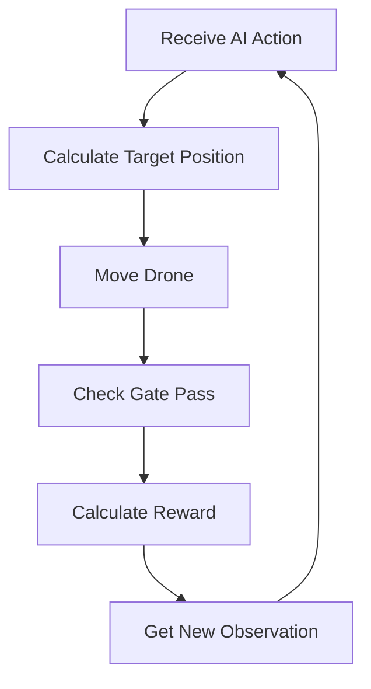

# AirSim Drone Racing Project: Autonomous Gate Racing using PPO

This project implements a reinforcement learning environment for training a drone to navigate through racing gates using the PPO (Proximal Policy Optimization) algorithm in AirSim. The system teaches a drone to autonomously race through gates while maintaining optimal speed, trajectory, and safety.

## Table of Contents
1. [Project Overview](#project-overview)
2. [Understanding the Learning Process](#understanding-the-learning-process)
3. [System Components](#system-components)
4. [Technical Implementation](#technical-implementation)
5. [Code Examples](#code-examples)

## Project Overview

### Goals
- Train a drone to autonomously navigate through racing gates
- Optimize flight paths for speed and precision
- Develop intelligent gate-passing strategies
- Maintain safety while maximizing performance

### System Architecture
- AirSim for realistic drone simulation
- PPO algorithm for reinforcement learning
- Custom reward system for behavior shaping
- Real-time state observation and decision making

## Table of Contents
1. [High-Level Overview](#high-level-overview)
2. [Key Components](#key-components)
3. [Understanding Observation Space](#understanding-observation-space)
4. [Action Space and Control](#action-space-and-control)
5. [Learning Process](#learning-process)
6. [Reward System](#reward-system)
7. [Technical Implementation](#technical-implementation)
8. [Code Examples](#code-examples)

## High-Level Overview

### Project Goals
- Train a drone to autonomously navigate through racing gates
- Optimize flight paths for speed and precision
- Develop intelligent gate-passing strategies
- Maintain safety while maximizing performance

### System Architecture
- AirSim for realistic drone simulation
- PPO algorithm for reinforcement learning
- Custom reward system for behavior shaping
- Real-time state observation and decision making

## Table of Contents
1. [Environment Overview](#environment-overview)
2. [Understanding the Code](#understanding-the-code)
3. [Observation Space Explained](#observation-space-explained)
4. [Action Space Explained](#action-space-explained)
5. [Step Function and Learning Process](#step-function-and-learning-process)
6. [Reward System](#reward-system)

## Key Components

### Core Functionality
The environment provides:
1. Realistic drone physics simulation
2. Sequential gate navigation
3. Real-time state monitoring
4. Adaptive reward system
5. Safety constraints

### Learning Framework
The system uses:
1. PPO (Proximal Policy Optimization)
2. Continuous action space
3. Multi-dimensional state observations
4. Dynamic reward shaping
5. Progressive learning stages

## Understanding Observation Space

The drone's understanding of its environment is based on 25 key values, each serving a specific purpose in navigation and decision-making. Here's a detailed breakdown with real-world analogies:

### 1. Class Initialization
```python
class GateRacingEnv(gym.Env):
    def __init__(self, gate_positions, gate_radius=3.0, render_mode=None):
        # Initialize AirSim connection
        self.client = airsim.MultirotorClient()
        self.client.confirmConnection()
        self.client.enableApiControl(True)
        self.client.armDisarm(True)
        
        # Gate setup
        self.gate_positions = np.array(gate_positions)
        self.num_gates = len(gate_positions)
        self.gate_radius = gate_radius
```
This sets up:
- Connection to AirSim simulator
- Gate positions and configuration
- Episode tracking variables

### 2. Action and Observation Spaces
```python
# Action space: [forward_offset, lateral_offset, vertical_offset, yaw_angle]
self.action_space = spaces.Box(
    low=np.array([-5.0, -5.0, -2.0, -np.pi]),
    high=np.array([15.0, 5.0, 2.0, np.pi]),
    dtype=np.float32
)

# Observation space (25 values)
self.observation_space = spaces.Box(
    low=-np.inf,
    high=np.inf,
    shape=(25,),
    dtype=np.float32
)
```

## Observation Space Explained

## Understanding the Learning Process

### How the Drone Learns

#### 1. Each Step Cycle
```
1. Observe Current State:
   - Where am I? (position)
   - How fast am I moving? (velocity)
   - Where's the gate? (target)
   - What's my orientation? (yaw)

2. AI Makes Decision:
   - How far forward to move [-5m to +15m]
   - How far left/right [-5m to +5m]
   - How far up/down [-2m to +2m]
   - What angle to turn [-180° to +180°]

3. Execute Movement:
   - Move to calculated position
   - Adjust orientation
   - Wait for movement to complete (0.5 seconds)

4. Evaluate Results:
   - Did I pass through a gate?
   - Am I closer to the gate?
   - Am I aligned properly?
   - Am I moving efficiently?
```

#### 2. Learning Through Rewards
```
The drone gets rewards for:

Immediate Feedback:
+250: Passing through a gate
+50:  Clean pass through center
-20:  Risky pass near edge

Progressive Feedback:
+50:  Getting very close to gate
+20:  Moving toward gate
+10-15: Staying centered

Penalty Feedback:
-15:  Bad approach angle
-50:  Going backward
-200: Crashing
```

#### 3. Learning Progression
```
Initial Stage:
1. Drone moves randomly
2. Sometimes gets closer to gate (+small reward)
3. Occasionally passes gate (+big reward)

Middle Stage:
1. Learns moving toward gate = good
2. Learns staying centered = better rewards
3. Learns smooth approach = consistent success

Advanced Stage:
1. Approaches gate efficiently
2. Stays centered for clean pass
3. Maintains momentum for next gate
```

## System Components

### 1. Observation Space (25 values)
Think of this as the drone's "senses". Here's what it knows:

#### Position and Movement (9 values)
- **Current Position** (3): Like GPS coordinates + height
  - Example: "I'm at (10.5, -3.2, 5.0) meters"
  - Real-world: Like being at "5th Avenue, 23rd Street, 3rd floor"

- **Current Velocity** (3): Speed and direction
  - Example: Moving at (5.0, 3.0, 1.0) meters/second
  - Real-world: Like a car's speedometer in 3D

- **Current Speed** (1): Overall movement rate
  - Example: 5.0 meters/second
  - Real-world: Basic speedometer reading

#### Gate Information (7 values)
- **Vector to Current Gate** (3): Direction to next gate
  - Example: Gate is (10m ahead, 2m right, 1m up)
  - Real-world: GPS saying "Turn right in 50m and go up one level"

- **Distance to Gate** (1): Direct distance
  - Example: Gate is 15 meters away
  - Real-world: "Next exit in 100 meters"

- **Vector to Next Gate** (3): Planning ahead
  - Example: Next gate is (-5m, -10m, -2m) from current gate
  - Real-world: GPS showing next turn after this one

#### Orientation and Alignment (8 values)
- **Forward Direction** (3): Where drone is pointing
- **Current Yaw** (1): Current heading
- **Desired Yaw** (1): Target heading
- **Yaw Error** (1): How far to turn
- **Lateral Offset** (1): Left/right from center
- **Vertical Offset** (1): Up/down from center

#### Progress Tracking (2 values)
- **Progress** (1): Gates completed / total gates
- **Time Remaining** (1): Available time ratio

### 2. Action Space
The drone can control four parameters:

```python
action_space = [
    forward_offset:  [-5m to +15m],   # More forward range for progress
    lateral_offset:  [-5m to +5m],    # Equal left/right movement
    vertical_offset: [-2m to +2m],    # Limited up/down for safety
    yaw_angle:      [-π to +π]        # Full rotation range
]
```

### 1. Drone Position (3 values: x, y, z)
- **What it is**: Like GPS coordinates plus height
- **Example**: Position (10.5, -3.2, 5.0) meters
- **Real-world analogy**: "I'm at 5th Avenue, 23rd Street, 3rd floor"

### 2. Drone Velocity (3 values: vx, vy, vz)
- **What it is**: Speed and direction in 3D space
- **Example**: Velocity (5.0, 3.0, 1.0) meters/second
- **Real-world analogy**: Car's speedometer showing northeast movement uphill

### 3. Vector to Current Gate (3 values: dx, dy, dz)
- **What it is**: Direction and distance to next gate
- **Example**: (10.0, 2.0, 1.0) meters
- **Real-world analogy**: GPS saying "Turn right in 50m and go up one level"

### 4. Distance to Current Gate (1 value)
- **What it is**: Direct distance to next gate
- **Example**: 15.0 meters
- **Real-world analogy**: "Next exit in 100 meters"

### 5. Vector to Next Gate (3 values)
- **What it is**: Direction to gate after current one
- **Example**: (-5.0, -10.0, -2.0) meters
- **Real-world analogy**: GPS showing next turn after current destination

### 6. Forward Direction (3 values)
- **What it is**: Direction drone is pointing
- **Example**: (1.0, 0.0, 0.1) [normalized vector]
- **Real-world analogy**: Car's hood direction

### 7. Orientation Values (3 values)
- **Current yaw**: Like a compass heading (0° = North)
- **Desired yaw**: Target heading
- **Yaw error**: How far to turn to reach desired heading

### 8. Position Offsets (2 values)
- **Lateral offset**: Left/right distance from ideal line
- **Vertical offset**: Up/down distance from ideal height

### 9. Performance Metrics (4 values)
- **Approach angle**: Angle relative to gate
- **Current speed**: Velocity magnitude
- **Progress**: Percentage of course completed
- **Time remaining**: Available time ratio

## Action Space Explained

The action space defines what the drone can do, with carefully chosen limits for each action:

### Forward Offset (-5.0 to 15.0 meters)
- **Backward limit (-5m)**: Limited backward movement for corrections
- **Forward limit (15m)**: Larger range for forward progress
- **Reason**: Encourages forward movement while allowing minor corrections

### Lateral Offset (-5.0 to 5.0 meters)
- **Range**: Equal movement left and right
- **Reason**: 
  - Symmetric for equal maneuverability
  - Limited to prevent getting too far off course
  - Enough range for gate alignment

### Vertical Offset (-2.0 to 2.0 meters)
- **Range**: Equal movement up and down
- **Reason**:
  - Smaller range than lateral movement
  - Gates typically have less vertical variation
  - Precise height control needed
  - Safety consideration for altitude changes

### Yaw Angle (-π to π radians)
- **Range**: Complete 360° rotation capability
- **Reason**:
  - Full rotational freedom
  - Uses radians for mathematical consistency
  - Allows facing any direction

## Step Function and Learning Process

The step function is the core of how the drone learns. Here's the process:

### 1. Single Step Cycle
```python
def step(self, action):
    # 1. Get current state
    state = self.client.getMultirotorState()
    
    # 2. Calculate target position
    target_pos, target_yaw = self._compute_target_from_action(action)
    
    # 3. Move drone
    self.client.moveToPositionAsync(...)
    
    # 4. Check results and calculate reward
    gate_passed = self._check_gate_pass(new_pos)
    reward = self._compute_reward(...)
```

### 2. Learning Flow


## Reward System

The reward system is designed to encourage optimal racing behavior:

### Major Rewards
- **+250**: Pass through gate
- **+50**: Clean pass through gate center
- **+1000**: Complete all gates
- **+50**: Get very close to gate

### Performance Bonuses
- **+10-20**: High-speed movement toward next gate
- **+10-15**: Staying centered when approaching
- **Speed bonus**: Up to +50 for fast gate passing

### Penalties
- **-20**: Passing through gate edge
- **-15**: Bad approach angle
- **-30**: Going wrong direction
- **-200**: Crashing
- **-1**: Time penalty

### Example Scenario
```python
# Initial State
drone_position = (0, 0, 5)
gate_position = (10, 0, 5)
observation = [0,0,5, 0,0,0, 10,0,0, 10, ...]

# AI Action
action = [5, 0, 0, 0]  # Move 5m forward

# Result
new_position = (5, 0, 5)
rewards = {
    'closer_to_gate': +25,
    'good_alignment': +10,
    'efficient_speed': +5
}
```

## Performance Metrics

The drone's performance is measured by:
1. Number of gates passed
2. Time taken
3. Smoothness of flight
4. Precision of gate passes
5. Overall efficiency

## Real-world Analogy

Think of the drone like a race car driver:
- **Position**: GPS location
- **Gates**: Checkpoints
- **Alignment**: Racing line
- **Speed**: Throttle control
- **Rewards**: Race points
- **Penalties**: Time penalties

This environment creates a comprehensive learning system where the drone gradually improves its racing performance through reinforcement learning, balancing speed, precision, and safety.

## Understanding the Learning Process

### How the Drone Learns

#### 1. Each Step Cycle
```
1. Observe Current State:
   - Where am I? (position)
   - How fast am I moving? (velocity)
   - Where's the gate? (target)
   - What's my orientation? (yaw)

2. AI Makes Decision:
   - How far forward to move [-5m to +15m]
   - How far left/right [-5m to +5m]
   - How far up/down [-2m to +2m]
   - What angle to turn [-180° to +180°]

3. Execute Movement:
   - Move to calculated position
   - Adjust orientation
   - Wait for movement to complete (0.5 seconds)

4. Evaluate Results:
   - Did I pass through a gate?
   - Am I closer to the gate?
   - Am I aligned properly?
   - Am I moving efficiently?
```

#### 2. Learning Through Rewards
```
The drone gets rewards for:

Immediate Feedback:
+250: Passing through a gate
+50:  Clean pass through center
-20:  Risky pass near edge

Progressive Feedback:
+50:  Getting very close to gate
+20:  Moving toward gate
+10-15: Staying centered

Penalty Feedback:
-15:  Bad approach angle
-50:  Going backward
-200: Crashing
```

#### 3. Learning Progression
```
Initial Stage:
1. Drone moves randomly
2. Sometimes gets closer to gate (+small reward)
3. Occasionally passes gate (+big reward)

Middle Stage:
1. Learns moving toward gate = good
2. Learns staying centered = better rewards
3. Learns smooth approach = consistent success

Advanced Stage:
1. Approaches gate efficiently
2. Stays centered for clean pass
3. Maintains momentum for next gate
```

## Detailed System Components

### 1. Observation Space (25 values)
Think of this as the drone's "senses". Here's what it knows:

#### Position and Movement (9 values)
- **Current Position** (3): Like GPS coordinates + height
  - Example: "I'm at (10.5, -3.2, 5.0) meters"
  - Real-world: Like being at "5th Avenue, 23rd Street, 3rd floor"

- **Current Velocity** (3): Speed and direction
  - Example: Moving at (5.0, 3.0, 1.0) meters/second
  - Real-world: Like a car's speedometer in 3D

- **Current Speed** (1): Overall movement rate
  - Example: 5.0 meters/second
  - Real-world: Basic speedometer reading

#### Gate Information (7 values)
- **Vector to Current Gate** (3): Direction to next gate
  - Example: Gate is (10m ahead, 2m right, 1m up)
  - Real-world: GPS saying "Turn right in 50m and go up one level"

- **Distance to Gate** (1): Direct distance
  - Example: Gate is 15 meters away
  - Real-world: "Next exit in 100 meters"

- **Vector to Next Gate** (3): Planning ahead
  - Example: Next gate is (-5m, -10m, -2m) from current gate
  - Real-world: GPS showing next turn after this one

#### Orientation and Alignment (8 values)
- **Forward Direction** (3): Where drone is pointing
- **Current Yaw** (1): Current heading
- **Desired Yaw** (1): Target heading
- **Yaw Error** (1): How far to turn
- **Lateral Offset** (1): Left/right from center
- **Vertical Offset** (1): Up/down from center

#### Progress Tracking (2 values)
- **Progress** (1): Gates completed / total gates
- **Time Remaining** (1): Available time ratio

### 2. Action Space Explained in Detail
The drone can control four parameters:

```python
action_space = [
    forward_offset:  [-5m to +15m],   # More forward range for progress
    lateral_offset:  [-5m to +5m],    # Equal left/right movement
    vertical_offset: [-2m to +2m],    # Limited up/down for safety
    yaw_angle:      [-π to +π]        # Full rotation range
]
```

These ranges are carefully chosen for optimal learning:
- Forward range is asymmetric to encourage forward progress
- Lateral movement is symmetric for equal maneuverability
- Vertical movement is limited for safety
- Full rotation range allows any orientation

This combination of observation space, action space, and reward system creates a learning environment where the drone can gradually develop advanced racing strategies while maintaining safety and efficiency.